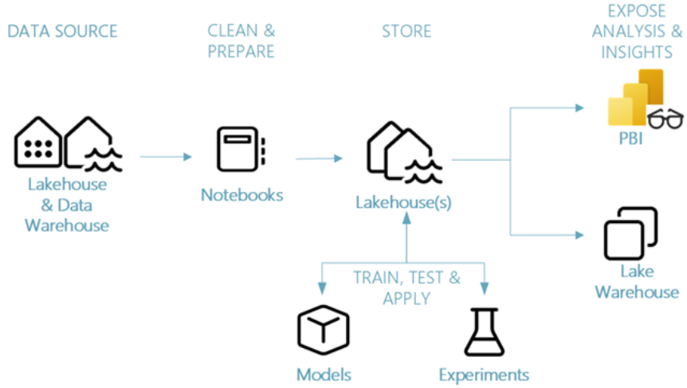

# 🧠 Taux d'Attrition Bancaire – Pipeline de Machine Learning avec Microsoft Fabric

Ce projet montre comment mettre en place un pipeline de **Data Science end-to-end** dans **Microsoft Fabric** pour prédire le taux d’attrition des clients d’une banque.

---

## 🗺️ Architecture du Projet

- **Data Source** : données chargées dans un Lakehouse ou un Data Warehouse
- **Clean & Prepare** : nettoyage, traitement et enrichissement via des notebooks
- **Store** : les données préparées sont stockées dans un Lakehouse
- **ML Phase** : entraînement de modèles, évaluation, et prédiction
- **Expose Insights** : consommation via Power BI ou SQL Endpoint

---

## 🧱 Étapes du Pipeline

| Étape | Dossier | Description |
|------|---------|-------------|
| 1️⃣ Ingestion des données | `1-ingest-data.Notebook` | Chargement initial des données dans Fabric |
| 2️⃣ Exploration & nettoyage | `2-explore-cleanse-data.Notebook` | Profilage, nettoyage, transformation |
| 3️⃣ Entraînement | `3-train-evaluate.Notebook` | Entraînement de modèles de machine learning |
| 4️⃣ Prédiction | `4-predict.Notebook` | Prédictions sur un jeu de données de test |

---

## 📂 Autres Composants

| Composant | Description |
|----------|-------------|
| `DataflowsStagingLakehouse.Lakehouse` | Stockage des données brutes et transformées |
| `DataflowsStagingWarehouse.Warehouse` | Option de stockage SQL structuré |
| `Lakehouse_datascience_tuto.Lakehouse` | Environnement principal du projet |
| `Taux Attrition Bank.Report` | Rapport Power BI pour visualiser les résultats |

---

## 🛠️ Technologies utilisées

- Microsoft Fabric (Lakehouse, Warehouse, Notebooks, Pipelines)
- Python & PySpark
- Power BI (Rapport d’analyse)
- ML intégrés dans notebooks Fabric

---

## 📊 Cas d’usage : Prédiction du churn client

Ce projet est utile pour :
- Identifier les clients à risque de départ
- Analyser les facteurs clés d’attrition
- Prendre des décisions proactives pour la fidélisation

---

## ✅ Résultat attendu

Un rapport Power BI prêt à l’emploi pour suivre :
- Le taux d’attrition global
- Les prédictions de churn par segment
- Les performances du modèle ML (précision, recall...)

---

## 📦 À venir (améliorations possibles)

- Intégration avec un Copilot Fabric
- Automatisation via pipeline Fabric
- Monitoring des performances du modèle

---

